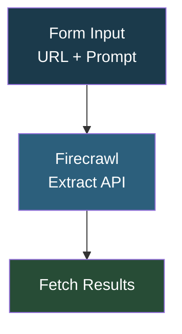

# Demo Flow - Firecrawl Web Scraper

## Overview

This is a **simple demo workflow for testing Firecrawl's web scraping capabilities**. You submit a website URL and a custom prompt through a form, and it sends an extraction request to Firecrawl to pull structured data (exhibitors, event details) from the page. It also includes disconnected test nodes for RapidAPI's social scraper and a generic Firecrawl template.

## How It Works

```
Form Input (URL + Prompt) -> Firecrawl Extract API -> Fetch Results
```

### Workflow Diagram



### Workflow Steps

1. **Form Trigger** - User submits a website URL and extraction prompt.
2. **Firecrawl Extract** - Sends a POST to Firecrawl's extract endpoint with a schema for exhibitors (name, booth number, description) and event details.
3. **Fetch Results** - Retrieves the extraction results using the job ID.

## Integrations

- **Firecrawl** - Web scraping and structured data extraction

## Setup

1. Import `Demo_flow.json` into your n8n instance.
2. Update the Firecrawl API key in the HTTP Request nodes.
3. Activate the workflow and submit a URL through the form.
